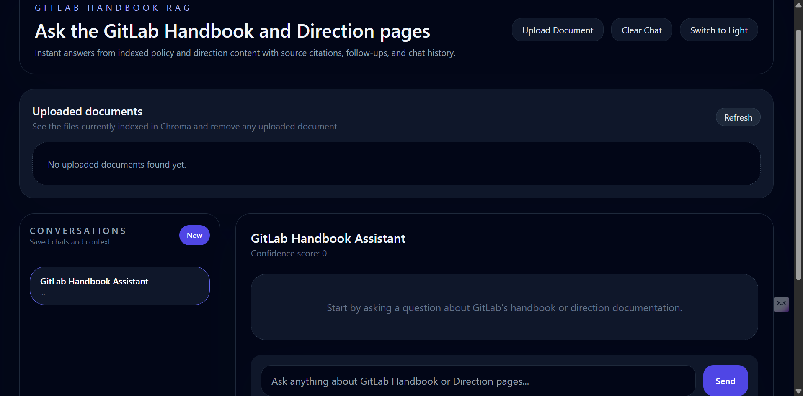

# 🤖 GitLab Handbook Assistant


An AI-powered Retrieval-Augmented Generation (RAG) chatbot designed to help employees and aspiring employees interact with GitLab's Handbook and Direction pages through natural language conversations.

The chatbot combines semantic search, vector databases, Google Gemini, and modern web technologies to provide accurate, context-aware responses while supporting document uploads, chat history, source citations, and dynamic knowledge management.

---

# 🚀 Live Demo

### Frontend

https://git-lab-chat-bot.vercel.app

### Backend API

https://gitlab-chatbot-1.onrender.com

### API Documentation

https://gitlab-chatbot-1.onrender.com/docs

---

# 📖 Project Overview

GitLab follows a "Build in Public" philosophy where company processes, strategies, and documentation are openly shared through the GitLab Handbook and Direction pages.

This project was built to make that information easier to access through a conversational AI assistant.

Instead of manually searching through hundreds of documentation pages, users can ask questions naturally and receive accurate responses powered by Retrieval-Augmented Generation (RAG).

---

# ✨ Key Features

## 🔍 AI-Powered Retrieval

* Retrieval-Augmented Generation (RAG)
* Semantic Search using Vector Embeddings
* Context-Aware Question Answering
* Google Gemini Integration
* Follow-up Question Suggestions
* Confidence Scoring
* Source-Based Answer Retrieval

---

## 📂 Document Management

### Upload Documents

Users can upload:

* PDF
* CSV
* TXT
* Markdown
* HTML

documents directly from the UI.

### Automatic Processing

Uploaded documents are:

* Extracted
* Cleaned
* Chunked
* Embedded
* Stored in ChromaDB

automatically.

### Dynamic Knowledge Base

* View uploaded documents
* See chunk counts
* Delete documents during active chat sessions
* Remove vectors instantly from ChromaDB

---

## 💬 Conversational Features

* Multi-turn conversations
* Session management
* Chat history support
* Redis-based memory
* Context retention
* Follow-up recommendations

---

## 🎨 Modern User Interface

* React + Vite Frontend
* Responsive Design
* Real-Time Updates
* Upload Interface
* Document Management Panel
* Error Handling
* Clean User Experience

---

# 📸 Screenshots

## Chat Interface




---

# 🏗️ System Architecture

```text
                    User Query
                         │
                         ▼
              React Frontend (Vite)
                         │
                         ▼
                 FastAPI Backend
                         │
         ┌───────────────┼───────────────┐
         │                               │
         ▼                               ▼
   Redis Memory                 ChromaDB Vector Store
                                         │
                                         ▼
                              Gemini Embeddings
                                         │
                                         ▼
                            Semantic Similarity Search
                                         │
                                         ▼
                              Relevant Context Retrieval
                                         │
                                         ▼
                               Gemini 2.5 Flash
                                         │
                                         ▼
                              Generated Response
                                         │
                                         ▼
                    Sources + Confidence + Suggestions
```

---

# 🛠️ Technology Stack

## Frontend

* React.js
* Vite
* Axios
* Tailwind CSS

## Backend

* FastAPI
* Python
* Uvicorn

## AI & Machine Learning

* Google Gemini 2.5 Flash
* Gemini Embeddings
* LangChain
* Retrieval-Augmented Generation (RAG)

## Databases & Storage

* ChromaDB
* Redis

## Deployment

* Vercel
* Render

---

# 📂 Project Structure

```text
GitLab-ChatBot/
│
├── frontend/
│   ├── public/
│   ├── src/
│   ├── components/
│   ├── api.js
│   └── package.json
│
├── backend/
│   ├── app/
│   │   ├── api/
│   │   ├── core/
│   │   ├── db/
│   │   ├── services/
│   │   ├── utils/
│   │   └── main.py
│   │
│   ├── uploads/
│   └── requirements.txt
│
├── requirements.txt
├── docker-compose.yml
├── render.yaml
├── vercel.json
└── README.md
```

---

# ⚙️ Local Setup

## Clone Repository

```bash
git clone https://github.com/lokeshgarg16/GitLab-ChatBot.git

cd GitLab-ChatBot
```

---

## Backend Setup

```bash
cd backend

python -m venv .venv

# Windows
.venv\Scripts\activate

# Linux/Mac
source .venv/bin/activate

pip install -r ../requirements.txt
```

---

## Environment Variables

Create:

```bash
backend/.env
```

```env
GEMINI_API_KEY=YOUR_GEMINI_API_KEY

REDIS_URL=redis://localhost:6379/0

CHROMA_PERSIST_DIRECTORY=./data/chroma

CHROMA_COLLECTION_NAME=gitlab_handbook

MAX_CHUNK_SIZE=500

CHUNK_OVERLAP=100
```

---

## Run Backend

```bash
uvicorn app.main:app --reload
```

Backend:

```text
http://localhost:8000
```

Swagger:

```text
http://localhost:8000/docs
```

---

## Frontend Setup

```bash
cd frontend

npm install
```

Create:

```bash
frontend/.env
```

```env
VITE_API_URL=http://localhost:8000
```

Run:

```bash
npm run dev
```

Frontend:

```text
http://localhost:5173
```

---

# 📡 API Endpoints

## Health Check

```http
GET /health/
```

---

## Chat Endpoint

```http
POST /chat/
```

Request:

```json
{
  "query": "How does GitLab handle product direction planning?",
  "session_id": "session-1"
}
```

---

## Upload Document

```http
POST /upload/
```

---

## List Uploaded Documents

```http
GET /upload/
```

---

## Delete Document

```http
DELETE /upload/{source}
```

---

# 🔄 How It Works

## Document Ingestion Pipeline

1. Upload Document
2. Extract Text
3. Clean Content
4. Split into Chunks
5. Generate Embeddings
6. Store in ChromaDB

---

## Question Answering Pipeline

1. User submits question
2. Generate query embedding
3. Search ChromaDB
4. Retrieve relevant chunks
5. Build contextual prompt
6. Generate response using Gemini
7. Return answer with sources and confidence score

---

# 🎯 Additional Enhancements

Beyond the assignment requirements, the following features were implemented:

* Dynamic Document Upload
* Mid-Chat Document Deletion
* Source Citations
* Confidence Scores
* Follow-Up Suggestions
* Redis Conversation Memory
* Persistent Vector Storage
* Production Deployment
* CORS Security
* Real-Time Knowledge Base Updates

---

# 📊 Future Improvements

* User Authentication
* Multi-User Sessions
* Role-Based Access Control
* Analytics Dashboard
* Hybrid Search
* GitLab Live Data Synchronization
* Fine-Tuned Domain Models

---

# 👨‍💻 Author

### Lokesh Agarwal

B.Tech Electronics & Communication Engineering

Malaviya National Institute of Technology (MNIT) Jaipur

GitHub:
https://github.com/lokeshgarg16

LinkedIn:
https://www.linkedin.com/in/lokeshagarwal1612/


